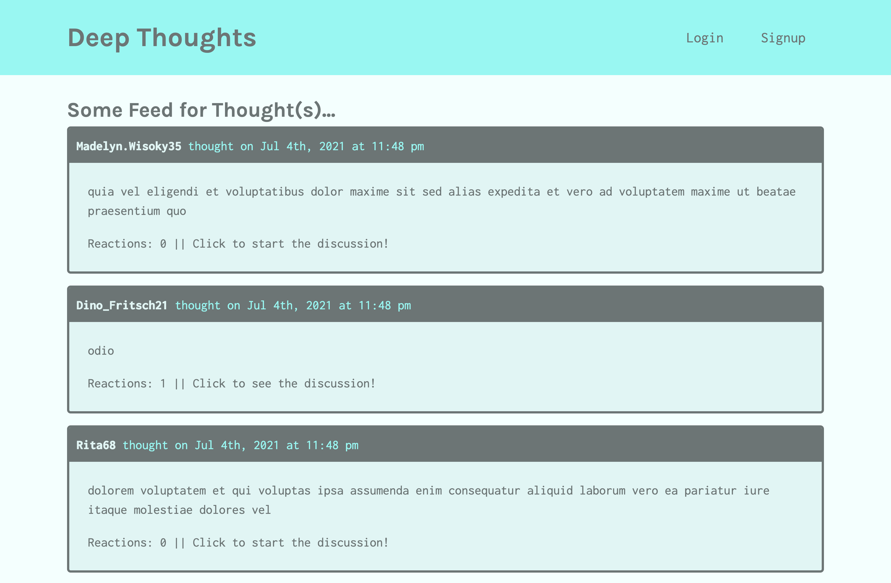

## Deep Thoughts 

## Description 
A social media application where the user can post their thoughts on the feed or react and engage in other discussions. 

## Tables of Contents
* [Installation](#installation)
* [Deployed App](#deployed-app)
* [Usage](#usage)
* [Questions](#questions)

## Installation 
* clone the repo
* `npm init --y`
* `npm install `
* `npm start`

## Deployed App
https://deep-thoughts-4jul21.herokuapp.com/

## Contributing
N/A

## Questions
For any questions please reach out to 
github: [celinalou92](https://github.com/celinalou92)
email: celinalouissaint@gmail.com

